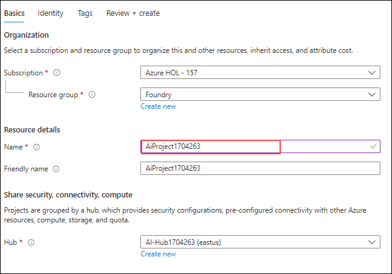
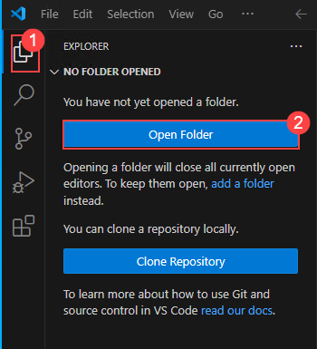
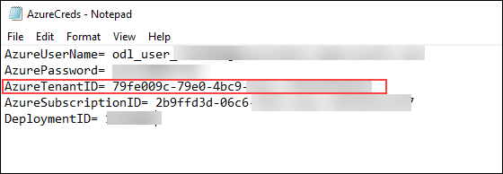

# Exercise 1: Set Up the Environment

## Estimated Time: 40 minutes

## Lab Overview

In this lab, you will set up the AI Foundry environment and configuring a Python-based development environment. You'll deploy essential connections and verify access to models, ensuring smooth execution of AI workflows. By completing this setup, you will be prepared to leverage Azure AI Foundry for building advanced AI solutions.

## Lab Objectives

In this lab, you will complete the following tasks:

- Task 1: Environment Setup in the Azure Portal
- Task 2: Environment Setup in Visual Studio Code
- Task 3: Update the Environment Variables

### Task 1: Environment Setup in the Azure Portal

In this task, you will deploy models, configure resources, and set up access in Azure AI Foundry.

1. In the Azure portal, search for and select Azure AI Search Resource.

   

1. Click on **Create** in the window appears.

   

1. Enter the following details:

   - Resource Group- Select **Foundry** (1)
   - Name: Enter **aisearch<inject key="Deployment ID	"></inject>** (2)
   - Region: Select **East US** (3)
   - Click on **Review+Create** (4) and click on **Create**

    

1. In the Azure portal, search for **azure foundry (1)** and select **Azure AI Foundry (2)**.

   

1. Under the **Create** dropdown, select **Hub**.

   

1. Provide the following details in the AI Hub window and leave everything else as default.

   - Resource Group: Select **Foundry** from the dropdown (1)
   - Name: **Ai-Hub<inject key="Deployment ID	"></inject>**(2)
   - Click **Review+Create**(3) followed by **Create**

     

1. Once the deployment is complete, click on **Go to Resource**.

1. Now, click on **+Create Project** in the window that appears.

   

1. Leave everything as default and give the project name as **AiProject<inject key="Deployment ID	"></inject>** and click on **Review+Create** followed by **Create**

   

1. Once the deployment is ready click on **Go to Resource**

1. From the Azure Ai Project window, click on **Launch Studio** to move to the Azure AI Foundry portal.

   

1. In the window that appears, copy the Project Connection String to a notepad file as you will need it in the further steps.

   

1. From the left navigation pane select **Models + Endpoints** option.

   

1. Select **+ Deploy Model** drop-down and select **Deploy a Base Model**

   

1. Search for and select gpt-4o model and click on **Confirm**

   

1. In the window that appears, click on **Deploy**

   

1. Next, lets deploy the text embedding model. Click on **Model and Endpoints** from the left pane. From the Dropdown of the Deploy a model select **Deploy a Base Model**.

1. Search for and select the  **text-embedding-3-large** and click on **Confirm**.

   

1. Click on **Deploy**

1. Click on **Models and Endpoints** and click on **Deploy a model** and select **Deploy a Base Model**. Now, search for and select **DeepSeek-R1 (1)** model and click on **Confirm (2)**.

   

1. In the pop-up that appears, click on **Agree and Proceed**.

1. In the deploy model window, click on **Connect and Deploy** to deploy the model.

   

1. Once the model is deployed click on **Models+Endpoints** from the left navigation pane to deploy **Phi-4 model.**

1. Select **+ Deploy Model** drop down and select **Deploy a Base Model**.

1. Search for and select **Phi-4 (1)** model and click on **Confirm (2)**.

   

1. In the pop-up that appears, click on **Agree and Proceed**.

1. In the deploy model window, click on **Deploy** to deploy the model.

   

1. From the left navigation pane, click on **Management Center**

   

1. Once the required models are deployed, we need to add the connections for the Bing resource and Azure AI Search resource in the Azure AI Foundry portal. Click on **Connected Resources (1)** from the left pane and click on **+ New Connection (2)**.

   

1. In the window that appears, select **Azure AI Search** resource.

   

1. Click on **Add Connection** by leaving everything else as default and once it is connected, you can click on **Close**.

   

1. Now let us add another connection.Click on **New Connection**.

1. In the window that appears scroll down and select **Grounding with Bing Search** option.

   

1. Leave everything else as default and click on **Add Connection** and once it is added, you can click on close.

   

1. From the connections window, copy the Azure OpenAI Service connection name and paste it in a notepad file as you will need it in the upcoming steps.

   

1. Once the connections are added, we need to add the user with developer permission. Click on **Users (1)** from the left pane and click on **+ New User (2)**.

   

1. Provide your Username: **<inject key="AzureAdUserEmail"></inject>** in place of New user and select the Role as **Azure AI Developer (2)**. Click on **Add (3)**.

   

### Task 2: Environment Setup in Visual Studio Code

In this task, you will set up Visual Studio Code with a virtual environment and install required packages.

1. Minimize your browser window and from the Lab VM select **Visual Studio Code**.

   

1. From the left pane, select **Explorer** (1) and click on **Open Folder** (2)

   

1. Navigate to C: Drive and choose **ai-foundry-workshop**(1) and click on **Select Folder** (2). In the prompt that appears, select **Yes I trust the authors**.

    

1. In the Visual Studio Code window, click on the **elipsis** (3) and choose **Terminal** (2) and click on **New Terminal** (3)

   

1. In the powershell terminal, let us first create the uv environnment by running the following command in the terminal.

   ```
     uv venv
    ```

1. Once the uv environment is created, we need to activate it by running the following command.

    ```
    .venv\Scripts\activate
    ```

1. Now, lets install the required packages in the isolated environment.The below command installs the  core Azure AI SDKs and Jupyter requirements in the uv environment.

    ```
    uv pip install azure-identity azure-ai-projects azure-ai-inference[opentelemetry] azure-search-documents azure-ai-evaluation azure-monitor-opentelemetry
    ```
   
1. Run the following command to install the required packages for Jupyter 

     ```
     uv pip install ipykernel jupyterlab notebook
    ```
1. Run the following command to register the kernel with Jupyter.
  
    ```
    python -m ipykernel install --user --name=.venv --display-name="Python (.venv)"
    ```
1. Run the following command to install the required packages.

   ```
   uv pip install -r requirements.txt --prerelease=allow
    ```

### Task 3: Update the Environment Variables

In this task, you will configure the .env file with project credentials and restart Visual Studio Code to apply the settings.

1. From the VM's desktop, open the **Azure Creds** file.

   

1. From the Azure Creds file, copy the Azure Tenant ID as we will be using it in the next step

   

1. From the left navigation pane in the Visual Studio Code window, click on the .env file.

   

1. In the .env file, enter the following details:

   - PROJECT_CONNECTION_STRING= *Project Connection String you copied in the previous task* 
   - TENANT_ID= *The Tenant ID you copied in the previous step*
   - SERVERLESS_MODEL_NAME= *Open AI Service Connection copied in the previous step*

1. Once you have entered the required details, click on **Ctrl+S** to save the file and it will look like as shown below

   

1. Once you have updated the .env file variables, kindly close and reopen the Visual Studio Code.

## Review

In this exercise, you have performed the following:

1. Set up key **Azure AI** resources.

2. Deployed AI models

3. Configured connections to Azure AI Search and Bing Search.

4. Prepared a **Python development** environment in Visual Studio Code.

5. Added essential environment variables for authentication and access.

## You have successfully completed this exercise. Kindly click  Next to proceed further
