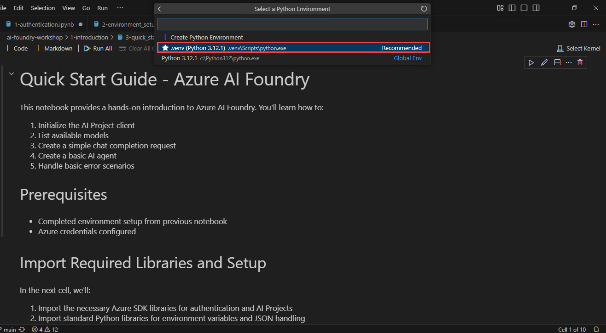
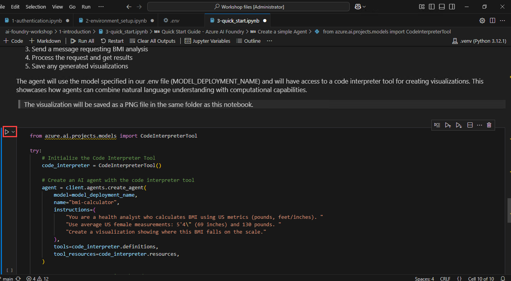

# Exercise 2: Introduction to Azure AI Foundry Workshop 

This lab introduces participants to the core functionalities of Azure AI Foundry, covering authentication, environment configuration, and project initialization. It lays the groundwork for utilizing AI models and developing AI-driven applications.

### Lab Overview

In this lab, you will authenticate credentials using Azure CLI, configure the AI Project Client, and validate model and search connections. You will also get hands-on experience with initializing AI projects, listing available models, and making your first chat completion request. By the end of this lab, you will have a functional AI workspace and a clear understanding of how to begin AI solution development using Azure AI Foundry.

### Estimated Time: 40 minutes

### Task 1: Authenticate your Credentials 

1. In the Visual Studio code window, in the left **explorer** panel, click on the dropdown next to **1-introduction (1)** and select **1-authentication.ipynb (2)** file.

    

1. In the top right corner of the Visual Studio Code Window, select the dropdown under **Select Kernel** option.

    

1. Select **Python Environments..**.

    

1. Select **.venv (Python 3.12.1)** which will be used as kernel for this workbook.

    

1. Click on the **Execute cell** button. Here, we are installing azure-identity package along with its related packages. If the packages are already installed, it will provide output as **Requirement already satisfied**. 

    

1. When the cell executes successfully, output will be expected as below.

    

1. Click on the **Execute cell** button for the next code cell. Here, the commands will redirect you to login to Azure portal by sign-in with Windows login.

    

1. Select the email provided to this lab and click on **Continue**.

    

1. If you have not logged-in to the provided email, select **Work or school account** and use the below credientials to login.
        
    Username:<inject key="AzureAdUserEmail"></inject>
    
    Password:<inject key="AzureAdUserPassword"></inject>
            
    .png)

1. When the cell executes successfully, output will be expected as below.

    

1. In the next code cell, we are testing the authentication by acquiring a token. Click on the **Execute cell** button.

    

1. When the cell executes successfully, output will be expected as below.

    

### Task 2: Configuring the Environment

1. In the left **explorer** panel, click on the dropdown next to **1-introduction (1)** and select **2-environment_setup.ipynb (2)** file.

    

1. In the top right corner of the Visual Studio Code Window, select the dropdown under **Select Kernel** option.

    

1. Select **.venv (Python 3.12.1)** which will be used as kernel for this workbook.

    

1. Click on the **Execute cell** button. Here, we are installing azure-ai-projects package along with its related packages. If the packages are already installed, it will provide output as **Requirement already satisfied**. 

    

1. When the cell executes successfully, output will be expected as below.

    

1. Scroll down and click on the **Execute cell** button for the next code cell. Here, we are verifying the Azure credentials and setup.

    

1. When the cell executes successfully, output will be expected as below.

    

1. Click on the **Execute cell** button for the next code cell. Here, we are initializing Project connection with the credentials.

    

1. When the cell executes successfully, output will be expected as below.

    

1. Click on the **Execute cell** button for the next code cell. Here, we are validating all connections to components used in this lab.

    

1. When the cell executes successfully, output will be expected as below.

    
    > Note: To verify the complete output block, scroll down at the end of output and click on ***scrollable element***.
        
     

1. Click on the **Execute cell** button for the next code cell. Here, we are validating connections for **Azure AI search** and **Azure Open AI**.

    

1. When the cell executes successfully, output will be expected as below.

    

### Task 3: Quick Start to the Workshop

1. In the left **explorer** panel, click on the dropdown next to **1-introduction (1)** and select **3-quick_start.ipynb (2)** file.

    

1. In the top right corner of the Visual Studio Code Window, select the dropdown under **Select Kernel** option.

    

1. Select **.venv (Python 3.12.1)** which will be used as kernel for this workbook.

    

1. Click on the **Execute cell** button. Here, we are importing necessary libraries and initializing credentials.

    

1. Click on the **Execute cell** button for the next code cell. Here, we are initializing Project connection with the credentials.

    

1. When the cell executes successfully, output will be expected as below.

    

1. Click on the **Execute cell** button for the next code cell. Here, we are providing single line prompt and make a simple completion request.

    

1. When the cell executes successfully, output will be expected as below.

    
    >Note: The output response might differ when this code cell is executed multiple times.

1. Click on the **Execute cell** button for the next code cell. Here, we are creating an agent with interpreter tool and a conversation thread and send it to an AI model which will process and provide an visualization output in image format.

    

1. When the cell executes successfully, output will be expected as below. There will be an image saved in the same directory.

    

    
