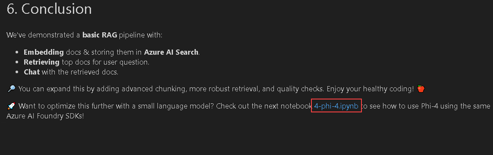

# Exercise 3: Chat Completion & Retrieval-Augmented Generation (RAG)

## Estimated Time: 45 minutes

## Lab Overview

In this lab, you’ll explore various tasks using the Azure AI Foundry SDK to create innovative health and fitness applications. You'll work with advanced AI tools like chat completions, embeddings, and retrieval-augmented generation (RAG) to enhance your projects. These tasks will involve embedding health-themed text and images, interacting with AI models, and utilizing Azure's powerful search and reasoning capabilities.

## Lab Objectives

In this lab, you will complete the following tasks:

- Task 1: Chat Completions using the Azure AI Foundry SDK
- Task 2: Health & Fitness embeddings
- Task 3: Retrieval-Augmented Generation (RAG) with AI Project Client
- Task 4: Phi-4 Model with AI Project Client
- Task 5: DeepSeek-R1 Model with Azure AI Inference 

### Task 1: Chat Completions using the Azure AI Foundry SDK

In this task, you will use the Azure AI Foundry SDK to configure a chat completion client, define a prompt, and generate responses from a fitness assistant model.

1. From the left pane in the Visual Studio Code window, click on the dropdown next to **2-notebooks** (1), then click on the dropdown next to **1-chat_completion** (2) and select **basic-chat-completion.ipynb** (3) file.

   

1. In the top left corner of the Visual Studio Code Window, select the dropdown under **Select Kernel (1)** option and choose **.venv(Python 3.12.1)** (2) and select the same in the option that appears under the search bar.

   

1. Let's begin by running the first cell in the notebook which will Load environment variables, create an `AIProjectClient`, and fetch a `ChatCompletionsClient`.

1. Hover over your mouse next to the cell and click on the **Run** option in the cell under **Initial Setup**.

   

1. You should ideally get an output stating that **Successfully Created AI Project Client**.

   

1. Next, in the prompt template run the cell will define a quick **system** message that sets the context as a friendly, disclaimer-providing fitness assistant.

1. Now let's try to get the output for the Chat Completion set-up that we have done. Run the cell under **Try Chat Completions** and observe the output.

   

1. Run the preceding cell and observe the output with placeholders in the system message.

### Task 2: Health & Fitness embeddings

In this task, you will generate text and image embeddings using Azure AI Foundry and apply prompt templates to enhance health-related contextual understanding.

1. Click on the **2-embeddings.ipynb** link to proceed with the next notebook.

   

1. This notebook demonstrates how to use Azure AI Foundry for embedding health-related text and images, generating a health-themed image, and applying prompt templates for enhanced context.

1. Hover over the first cell under the Setup and Environment and run the cell to set-up the prerequisite of creating AIProjectClient.

1. Next, run the cell under  **Text Embeddings** that will call `get_embeddings_client()` from our `AIProjectClient` to retrieve the embeddings client.

1. Run the cells under **Prompt Template Example** to  add context to a user message. For example, you can prepend a system prompt like "You are HealthFitGPT, a fitness guide..." to provide more context for the embedding. Observe the output of the embedding result.

1. Moving on to the Image Embedding where we are using a sample image to generate image embeddings.

   >**Note:** You can view the sample image we are using by navigating to the hand-xray.png file

     

1. We can optionally generate images with the Dall-E-Model in Azure Open AI. You don't have to run this cell, you can view the generated image for a health-related prompt.

   

### Task 3: Retrieval-Augmented Generation (RAG) with AI Project Client

In this task, you will implement a basic Retrieval-Augmented Generation (RAG) workflow by embedding health tips, indexing them, and querying with an LLM to generate context-aware responses.

1. From the left navigation pane in the Visual Studio Code window, select **3-basic-rag.ipynb** file.

   

1. Our theme is **Health & Fitness** so we’ll create a simple set of health tips, embed them, store them in a search index, then do a query that retrieves relevant tips, and pass them to an LLM to produce a final answer.

1. Run the cells in the notebook one by one and observe the final output where the LLM (Large Language Model) uses relevant retrieved text chunks from your data to craft a final answer from the health_tips report.

   

### Task 4: Phi-4 Model with AI Project Client 

In this task, you will configure the Phi-4 model in the .env file and run a notebook to explore its output using the AI Project Client.

1. Let's explore the Phi-4 model by clicking on the  link which directs to the Phi-4 notebook.

   

1. Before proceeding with running the cells, we need to edit .env file with the **Phi-4** model.
   
1. Navigate to the .env file from the left pane 

   

1. Edit the **Serveless_Model_Name** with **Phi-4**.

   

1. Move back to the **phi-4.ipynb** file and run each cell one by one and observe the output given by the Phi-4 model.  

   

### Task 5: DeepSeek-R1 Model with Azure AI Inference 

In this task, you will configure and test the DeepSeek-R1 model by setting environment variables, initializing the client, and running sample queries in a Jupyter notebook.

1. From the left navigation pane in the Visual Studio Code window, select **5-deep-seek-r1.ipynb** file.

   
  
1. In the top left corner of the Visual Studio Code Window, select the dropdown under **Select Kernel (1)** option and choose **.venv(Python 3.12.1)** (2) and select the same in the option that appears under the search bar.

   

1. Before proceeding with running the cells, we need to edit .env file with the DeepSeek-R1 model configurations.

1. Navigate to **Azure portal**, open the resource group where **Azure AI services** are deployed and select the **Azure AI project** which is used for this exercise.

   

1. Click on **Launch studio**.

   

1. In the overview page of Azure AI foundry portal, copy **API key (1)** and **Azure AI model interference endpoint (2)**.

   

1. Navigate to the .env file from the left pane 

   

1. Paste the copied values in .env files with variables defined as shown below.

   ```
   Azure_INFERENCE_ENDPOINT=<ENTER-COPIED-INFERENCE-ENDPOINT>
   AZURE_INFERENCE_KEY=<ENTER-COPIED-INFERENCE-KEY>
   MODEL_NAME=DeepSeek-R1
   ```

   

1. Click on the **Execute cell** button. Here, we are loading the environment with the variables defined in previous step and initializing the client.

   

1. When the cell executes successfully, output will be expected as below.

   

1.  Click on the **Execute cell** button for the next code cell. Here, we are providing sample query to Deepseek-R1 model and test its capability.

    

1. When the cell executes successfully, output will be expected as below.

   

1.  Click on the **Execute cell** button for the next code cell. Here, we are providing technical problem to DeepSeek-R1 model and test its capability. 

    

1. When the cell executes successfully, output will be expected as below.

   

## Review

In this exercise, you have performed the following:

1. Used the **Azure AI Foundry SDK** to perform chat completions tailored to health and fitness applications.

2. Generated **text and image embeddings** from health-related content to support enhanced AI interactions.

3. Built a basic **Retrieval-Augmented Generation (RAG) pipeline** to retrieve health tips and generate answers using an LLM.

4. Configured and tested the **Phi-4** model for contextual responses.

5. Integrated the **DeepSeek-R1 model** using inference endpoints and evaluated its performance on general and technical queries.

## You have successfully completed the exercise. Kindly click Next to proceed further.
