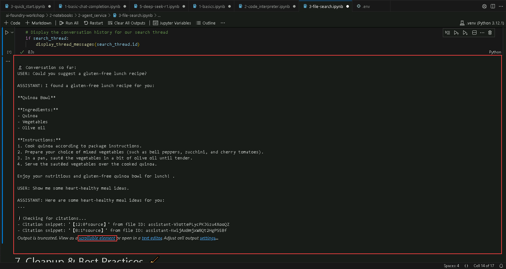

# Exercise 4: Agent Development 

This lab focuses on building AI agents using the Azure AI Foundry SDK, enabling them to perform specialized tasks such as health coaching, nutrition analysis, and intelligent search. By leveraging agentic AI principles, participants will create autonomous AI systems capable of reasoning, decision-making, and interacting with external tools to enhance their capabilities.

### Lab Overview

In this lab, you will develop AI agents tailored for health and fitness applications. You will begin by creating a wellness assistant capable of providing fitness and nutrition guidance. Then, you'll extend its functionality by incorporating tools like a code interpreter for BMI calculations, a file search agent for retrieving health resources, and a Bing Grounding tool for real-time web-based insights. Additionally, you’ll integrate Azure AI Search for enhanced data retrieval and explore the interaction between AI agents and Azure Functions for event-driven automation. By completing this lab, you will gain hands-on experience in building and enhancing AI agents with multi-agent collaboration, real-world reasoning, and dynamic task execution.

### Estimated Time: 40 minutes

### Task 1: Azure AI Foundry SDKs to create a playful health and fitness assistant

1. From the left pane in the Visual Studio Code window, click on the dropdown next to **2-notebooks** (1), then click on the dropdown next to **2-agent_service** (2) and select **1-basics.ipynb** (3) file.

    

1. In the top left corner of the Visual Studio Code Window, select the dropdown under **Select Kernel (1)** option and choose **.venv(Python 3.12.1)** (2) and select the same in the option that appears under the search bar.

    

1. Click on the **Execute cell** button. Here, we are loading the environment with the variables from .env file and initializing the client.

    

1. When the cell executes successfully, output will be expected as below.

    

1. Click on the **Execute cell** button for the next code cell. Here, we are creating a health advisor agent.

    

1. When the cell executes successfully, output will be expected as below.

    

1. Click on the **Execute cell** button for the next code cell. Here, we are creating a thread where user's message and agent's responses are stored.

    

1. When the cell executes successfully, output will be expected as below.

    

1. Click on the **Execute cell** button for the next code cell. Here, we are creating messages from the user about typical health questions.

    

1. Click on the **Execute cell** button for the next code cell. Here, we are asking queries to agent and see the agent's disclaimers and how it handles typical health questions.

    

1. When the cell executes successfully, output will be expected as below.

    

1. Click on the **Execute cell** button for the next code cell. We are deleting the agent created for this task.

    

1. When the cell executes successfully, output will be expected as below.

    

### Task 2: Health Calculator Agent

1. Click on the **2-code_interpreter.ipynb** link to proceed with the next notebook.

    

1. In the top left corner of the Visual Studio Code Window, select the dropdown under **Select Kernel (1)** option and choose **.venv(Python 3.12.1)** (2) and select the same in the option that appears under the search bar.

    

1. Click on the **Execute cell** button. Here, we are loading the environment with the variables from .env file, initializing the client and creating a csv file.

    

1. When the cell executes successfully, output will be expected as below. Also, notice a csv file with name **nutrition_data.csv** is created in the left pane.

    

1. Click on the **Execute cell** button for the next code cell. Here, we are creating an agent with **Code Interpreter** enabled.

    

1. When the cell executes successfully, output will be expected as below.

    

1. Click on the **Execute cell** button for the next code cell. Here, we are creating a thread for BMI calculations.

    

1. When the cell executes successfully, output will be expected as below.

    

1. Click on the **Execute cell** button for the next code cell. Here, we are creating another thread where the user can ask the agent to analyze the **nutrition_data.csv** we uploaded.

    

1. When the cell executes successfully, output will be expected as below.

    

1. Click on the **Execute cell** button for the next code cell. Here, we are getting results by using the threads created in previous steps.

    

1. When the cell executes successfully, output will be expected as below. Also, an image is created that have graph along with output results.

    

    

1. Click on the **Execute cell** button for the next code cell. We are deleting the agent, uploaded file and csv file created for this task.

    

1. When the cell executes successfully, output will be expected as below.

    

### Task 3: Health Resource Search Agent

1. Click on the **3-file-search.ipynb** link to proceed with the next notebook.

    

1. In the top left corner of the Visual Studio Code Window, select the dropdown under **Select Kernel (1)** option and choose **.venv(Python 3.12.1)** (2) and select the same in the option that appears under the search bar.

     

1. Click on the **Execute cell** button. Here, we are loading the environment with the variables from .env file and initializing the client.

    

1. When the cell executes successfully, output will be expected as below.

    

1. Click on the **Execute cell** button for the next code cell. Here, we are creating some dummy markdown (.md) files, then store them in a vector store for searching.

    

1. When the cell executes successfully, output will be expected as below. Also, from the left pane, check that **guidelines.md** and **recipies.md** files. 

    

1. Click on the **Execute cell** button for the next code cell. Here, we are uploading newly created files and group them into a single vector store for searching.

    

1. When the cell executes successfully, output will be expected as below.

    

1. Click on the **Execute cell** button for the next code cell. Here, we are creating agent with name **health-search-agent**.

    

1. When the cell executes successfully, output will be expected as below.

    

1. Click on the **Execute cell** button for the next code cell. Here, we are creating a conversation thread message which will be given to agent.

    

1. When the cell executes successfully, output will be expected as below.

    

1. Click on the **Execute cell** button for the next code cell. Here, we are getting the output from agent by providing the thread created in previous step.

    

1. When the cell executes successfully, output will be expected as below.

    

1. Click on the **Execute cell** button for the next code cell. We are deleting the agent, uploaded file, vector store and local sample files for this task.

    

1. When the cell executes successfully, output will be expected as below.

    

### Task 4: Health & Fitness Agent with Bing Grounding

1. Click on the **4-bing_grounding.ipynb** link to proceed with the next notebook.

    

1. In the top left corner of the Visual Studio Code Window, select the dropdown under **Select Kernel (1)** option and choose **.venv(Python 3.12.1)** (2) and select the same in the option that appears under the search bar.

    

1. Click on the **Execute cell** button. Here, we are loading the environment with the variables from .env file and initializing the client.

    

1. When the cell executes successfully, output will be expected as below.

    

1. Replace the highlighted `BING_CONNECTION_NAME` with `GROUNDING_WITH_BING_CONNECTION_NAME` and click on the **Execute cell** button. Here, we are creating agent with name **health-bing-agent**.

    

1. When the cell executes successfully, output will be expected as below.

    

1. Replace the highlighted `assistant_id` with `agent_id` and click on the **Execute cell** button. Here, we are creating multiple conversation threads for agent.

    

1. When the cell executes successfully, output will be expected as below.

    

1. Click on the **Execute cell** button for the next code cell. Here, we are providing the threads created in previous step to the agent and getting the output. 

    

1. When the cell executes successfully, output will be expected as below. Click on **scrollable element** to read full output message.

    

1. Click on the **Execute cell** button for the next code cell. We are deleting the agent created for this task.

    

1. When the cell executes successfully, output will be expected as below.

    

### Task 5: AI Search + Agent Service: Fitness-Fun Example

1. Click on the **5-agents-aisearch.ipynb** link to proceed with the next notebook.

    

1. In the top left corner of the Visual Studio Code Window, select the dropdown under **Select Kernel (1)** option and choose **.venv(Python 3.12.1)** (2) and select the same in the option that appears under the search bar.

    

1. Click on the **Execute cell** button. Here, we are creating Search index client and Search client.

    

1. When the cell executes successfully, output will be expected as below.

    

1. Click on the **Execute cell** button for the next code cell. Here, we are creating search index with name **myfitnessindex**.

    

1. When the cell executes successfully, output will be expected as below.

    

1. Click on the **Execute cell** button for the next code cell. Here, we are adding sample documents to search index created in previous step.

    

1. When the cell executes successfully, output will be expected as below.

    

1. Click on the **Execute cell** button for the next code cell. Here, we are verifying the search index.

    

1. When the cell executes successfully, output will be expected as below.

    

1. Click on the **Execute cell** button for the next code cell. Here, we are loading the environment with the variables from .env file and initializing the client.

    

1. When the cell executes successfully, output will be expected as below.

    

1. Click on the **Execute cell** button for the next code cell. Here, we are finding Azure AI search connection id along with Index endpoint.

    

1. When the cell executes successfully, output will be expected as below.

    

1. Click on the **Execute cell** button for the next code cell. Here, we are creating agent with name **fitness-agent-search**.

    

1. When the cell executes successfully, output will be expected as below.

        

1. Click on the **Execute cell** button for the next code cell. Here, we are creating a thread message and ask the agent to search the index and provide output.

    

1. When the cell executes successfully, output will be expected as below.

    

1. Click on the **Execute cell** button for the next code cell. We are deleting the agent created for this task.

    

1. When the cell executes successfully, output will be expected as below.

    

## Review

In this exercise, you have performed the following:

1. Created a health and fitness assistant agent using the Azure AI Foundry SDK, capable of handling user queries with disclaimers and guidance.

2. Built a Health Calculator Agent using a code interpreter for BMI calculations and CSV-based nutrition analysis, including visual outputs.

3. Developed a File Search Agent that utilized vector search on markdown documents to answer user queries based on local health content.

4. Integrated Bing Grounding for real-time web information access in agent responses.

5. Combined Azure AI Search with agents to retrieve fitness data from a search index and deliver responses via a chat interface.

## Click Next to proceed further
