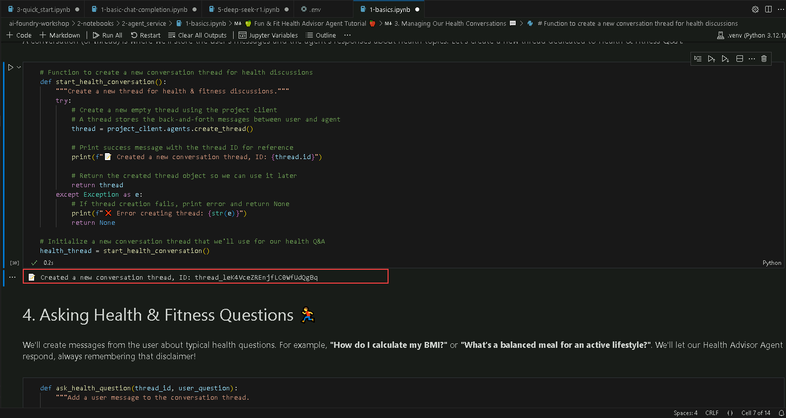

# Exercise 4: Agent Development 

This lab focuses on building AI agents using the Azure AI Foundry SDK, enabling them to perform specialized tasks such as health coaching, nutrition analysis, and intelligent search. By leveraging agentic AI principles, participants will create autonomous AI systems capable of reasoning, decision-making, and interacting with external tools to enhance their capabilities.

### Lab Overview

In this lab, you will develop AI agents tailored for health and fitness applications. You will begin by creating a wellness assistant capable of providing fitness and nutrition guidance. Then, you'll extend its functionality by incorporating tools like a code interpreter for BMI calculations, a file search agent for retrieving health resources, and a Bing Grounding tool for real-time web-based insights. Additionally, you’ll integrate Azure AI Search for enhanced data retrieval and explore the interaction between AI agents and Azure Functions for event-driven automation. By completing this lab, you will gain hands-on experience in building and enhancing AI agents with multi-agent collaboration, real-world reasoning, and dynamic task execution.

### Estimated Time: 40 minutes

### Task 1: Azure AI Foundry SDKs to create a playful health and fitness assistant

1. From the left pane in the Visual Studio Code window, click on the dropdown next to **2-notebooks** (1), then click on the dropdown next to **2-agent_service** (2) and select **1-basics.ipynb** (3) file.

    

1. In the top left corner of the Visual Studio Code Window, select the dropdown under **Select Kernel (1)** option and choose **.venv(Python 3.12.1)** (2) and select the same in the option that appears under the search bar.

   

1. Let's begin by running the first cell in the notebook which will Load environment variables, create an `AIProjectClient`, and fetch a `ChatCompletionsClient`.

1. Click on the **Execute cell** button. Here, we are loading the environment with the variables from .env file and initializing the client.

    

1. When the cell executes successfully, output will be expected as below.

    

1. Click on the **Execute cell** button for the next code cell.

    

1. When the cell executes successfully, output will be expected as below.

    

1. Click on the **Execute cell** button for the next code cell.

    

1. When the cell executes successfully, output will be expected as below.

    

1. Click on the **Execute cell** button for the next code cell.

    

1. Click on the **Execute cell** button for the next code cell.

    

1. When the cell executes successfully, output will be expected as below.

    

1. Click on the **Execute cell** button for the next code cell.

    

1. When the cell executes successfully, output will be expected as below.

    

### Task 2: Health Calculator Agent

### Task 3: Health Resource Search Agent

### Task 4: Health & Fitness Agent with Bing Grounding

### Task 5: AI Search + Agent Service: Fitness-Fun Example

### Task 6: Fitness Fun: Azure Functions + AI Agent