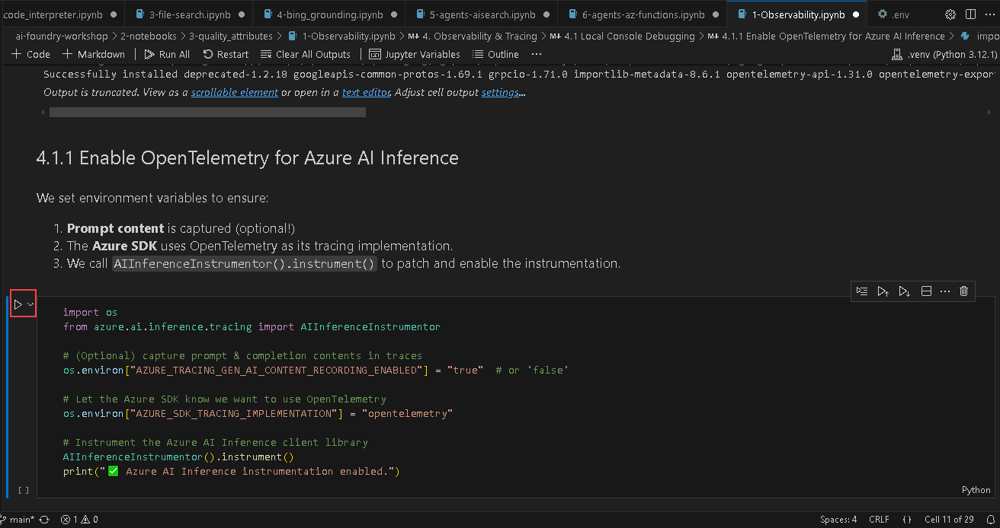

# Exercise 5: Enhance the Agent 

## Estimated Time: 40 minutes

## Lab Overview

In this lab, you will integrate observability and tracing mechanisms to monitor AI agent interactions using OpenTelemetry and Azure Monitor. You will evaluate AI models for quality, safety, and security while running automated assessments for large language model (LLM) outputs. Additionally, you will explore end-to-end GenAI operations, covering model listing, mitigation strategies, and Retrieval-Augmented Generation (RAG) evaluation. By the end of this lab, you will have a deeper understanding of how to optimize AI agents for reliability, transparency, and compliance.

## Lab Objectives

In this lab, you will complete the following task:

Task 1: Observability & Tracing Demo with azure-ai-projects and azure-ai-inference

### Task 1: Observability & Tracing Demo with azure-ai-projects and azure-ai-inference

In this task, you will configure and demonstrate observability and tracing features in Azure AI services. You'll interact with the Azure portal, set up tracing, and monitor the execution of AI models.

1. From the left pane in the Visual Studio Code window, click on the dropdown next to **2-notebooks** (1), then click on the dropdown next to **3-quality_attributes** (2) and select **1-Observability.ipynb** (3) file.

    

1. In the top left corner of the Visual Studio Code Window, select the dropdown under **Select Kernel (1)** option and choose **.venv(Python 3.12.1)** (2) and select the same in the option that appears under the search bar.

    

1. Click on the **Execute cell** button. Here, we are loading the environment with the variables from .env file and initializing the client.

    

1. When the cell executes successfully, output will be expected as below.

    

1. Click on the **Execute cell** button for the next code cell.

    

1. When the cell executes successfully, output will be expected as below.

    

1. Click on the **Execute cell** button for the next code cell.

    

1. When the cell executes successfully, output will be expected as below.

    

1. Click on the **Execute cell** button for the next code cell.

    

1. When the cell executes successfully, output will be expected as below.

    

1. Click on the **Execute cell** button for the next code cell.

    

1. When the cell executes successfully, output will be expected as below.

    

1. Click on the **Execute cell** button for the next code cell.

    

1. When the cell executes successfully, output will be expected as below.

    

1. Click on the **Execute cell** button for the next code cell.

    

1. When the cell executes successfully, output will be expected as below.

    

1. Navigate to **Azure portal**, open the resource group where **Azure AI services** are deployed and select the **Azure AI project** which is used for this exercise.

    

1. Click on **Launch studio**.

    

1. In the overview page of Azure AI foundry portal, click on **Tracing** from the left pane.

    

1. Click on **Create new**.

    

1. Provide the name as **insights-<inject key="DeploymentID"></inject>**, click on **Advanced settings** to check the details and click on **Create**.

        

1. Click on the **Execute cell** button for the next code cell.

    

1. When the cell executes successfully, output will be expected as below.

    

1. Click on the **Execute cell** button for the next code cell.

    

1. When the cell executes successfully, output will be expected as below.

    

1. Click on the **Execute cell** button for the next code cell.

    

1. When the cell executes successfully, output will be expected as below.

    

1. Click on the **Execute cell** button for the next code cell.

    

1. When the cell executes successfully, output will be expected as below.

    

1. Click on the **Execute cell** button for the next code cell.

    

1. When the cell executes successfully, output will be expected as below.

    

1. Click on the **Execute cell** button for the next code cell.

    

1. When the cell executes successfully, output will be expected as below.

    

## Review
 
In this exercise, you performed the following:

 1. Integrated **observability** into AI agents using Azure AI Foundry SDK and OpenTelemetry to trace and monitor interactions effectively.

 2. Executed step-by-step tracing workflows in VS Code notebooks to **visualize and verify agent performance** via Azure Monitor.

3. Configured tracing sessions in the Azure AI Foundry portal to capture detailed **insights on agent behavior** and requests.

## You have successfully completed the exercise.Kindly click Next to proceed further
