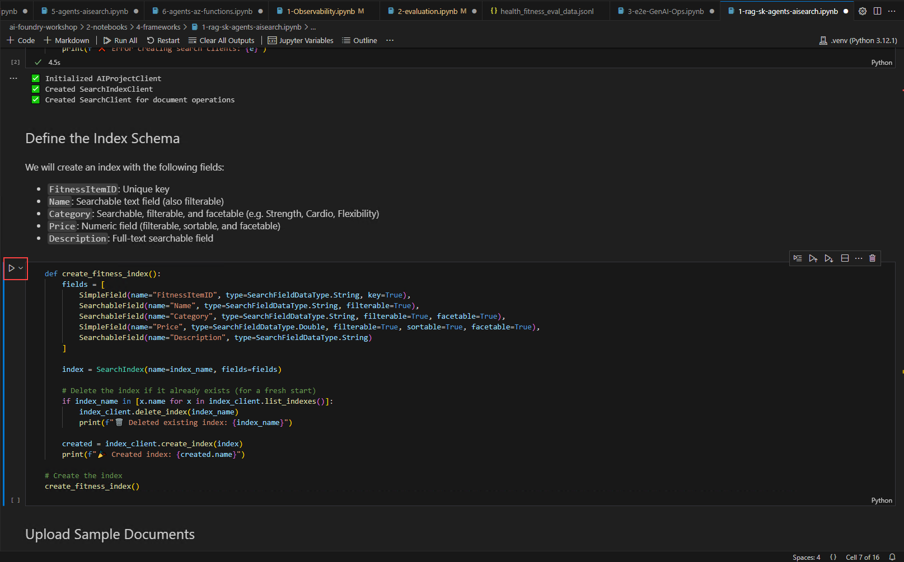

# Exercise 6: Fitness-Fun Workshop 

This lab explores the integration of AI agents with Azure AI Search and Semantic Kernel to create interactive and intelligent health and fitness solutions. By leveraging multi-agent collaboration and retrieval-augmented generation (RAG), participants will develop AI-powered applications capable of searching, reasoning, and responding to complex queries in the fitness domain.

### Lab Overview

In this lab, you will build an AI-driven fitness assistant by integrating Azure AI Search with a Semantic Kernel Agent. You will upload and index fitness-related data, create an agent to interact with this data, and enable asynchronous conversations for dynamic queries. Additionally, you will implement a multi-agent RAG pipeline to enhance AI responses with structured health data retrieval. By the end of this lab, you will have a robust understanding of AI-driven search, multi-agent collaboration, and advanced reasoning techniques for health and fitness applications.

### Estimated Time: 40 minutes

### Task 1: Azure AI Search + Semantic Kernel + AI Agents

1. From the left pane in the Visual Studio Code window, click on the dropdown next to **2-notebooks** (1), then click on the dropdown next to **4-frameworks** (2) and select **1-rag-sk-agents-aisearch.ipynb** (3) file.

    

1. In the top left corner of the Visual Studio Code Window, select the dropdown under **Select Kernel (1)** option and choose **.venv(Python 3.12.1)** (2) and select the same in the option that appears under the search bar.

    

1. Click on the **Execute cell** button. 

    

1. When the cell executes successfully, output will be expected as below.

    

1. Click on the **Execute cell** button for the next code cell. Here, we are loading the environment with the variables from .env file and initializing the client.

    

1. When the cell executes successfully, output will be expected as below.

    

1. Click on the **Execute cell** button for the next code cell.

    

1. When the cell executes successfully, output will be expected as below.

    

1. Click on the **Execute cell** button for the next code cell.

    

1. When the cell executes successfully, output will be expected as below.

    

1. Click on the **Execute cell** button for the next code cell.

    

1. When the cell executes successfully, output will be expected as below.

    

1. Click on the **Execute cell** button for the next code cell.

    

1. When the cell executes successfully, output will be expected as below.

    

1. Click on the **Execute cell** button for the next code cell.

    

1. When the cell executes successfully, output will be expected as below.

    

### Task 2: Multi-Agent RAG for Fitness & Health with Azure AI Foundry

1. From the left pane in the Visual Studio Code window, click on the dropdown next to **2-notebooks** (1), then click on the dropdown next to **4-frameworks** (2) and select **2-autogen-multi-agent-rag.ipynb** (3) file.

    

1. In the top left corner of the Visual Studio Code Window, select the dropdown under **Select Kernel (1)** option and choose **.venv(Python 3.12.1)** (2) and select the same in the option that appears under the search bar.

    

1. Navigate to **.env** file from the left pane.

    

1. Paste the Personal Access Token (PAT) with variable name `GITHUB_TOKEN` in **.env** file.

    .png)

1. Click on the **Execute cell** button. 

    

1. When the cell executes successfully, output will be expected as below.

    

1. Click on the **Execute cell** button for the next code cell.

    

1. When the cell executes successfully, output will be expected as below.

    

1. Click on the **Execute cell** button for the next code cell.

    

1. When the cell executes successfully, output will be expected as below.

    

1. Click on the **Execute cell** button for the next code cell.

    

1. When the cell executes successfully, output will be expected as below.

    