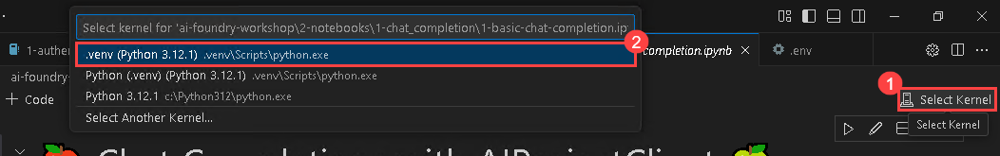
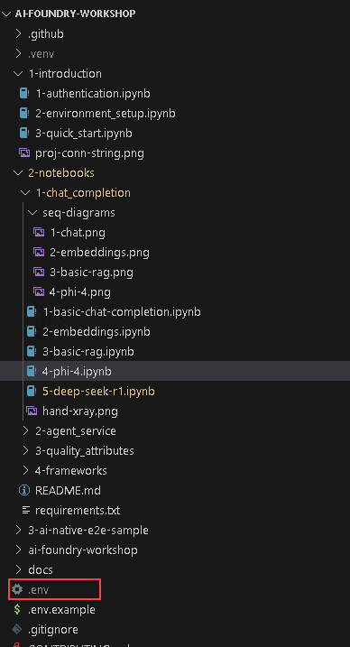

# Exercise 6: Fitness-Fun Workshop 

## Estimated Time: 40 minutes

## Lab Overview

In this lab, you will build an AI-driven fitness assistant by integrating Azure AI Search with a Semantic Kernel Agent. You will upload and index fitness-related data, create an agent to interact with this data, and enable asynchronous conversations for dynamic queries. Additionally, you will implement a multi-agent RAG pipeline to enhance AI responses with structured health data retrieval. By the end of this lab, you will have a robust understanding of AI-driven search, multi-agent collaboration, and advanced reasoning techniques for health and fitness applications.

## Lab Objectives

In this lab, you will complete the following tasks:

- Task 1: Azure AI Search + Semantic Kernel + AI Agents
- Task 2: Multi-Agent RAG for Fitness & Health with Azure AI Foundry
  
### Task 1: Azure AI Search + Semantic Kernel + AI Agents

In this task, you will be integrating Azure AI Search with Semantic Kernel to create AI agents that can perform search and provide results.

1. From the left pane in the Visual Studio Code window, click on the dropdown next to **2-notebooks** (1), then click on the dropdown next to **4-frameworks** (2) and select **1-rag-sk-agents-aisearch.ipynb** (3) file.

    

1. In the top left corner of the Visual Studio Code Window, select the dropdown under **Select Kernel (1)** option and choose **.venv(Python 3.12.1)** (2) and select the same in the option that appears under the search bar.

    

1. Click on the **Execute cell** button. 

    

1. When the cell executes successfully, output will be expected as below.

    

1. Click on the **Execute cell** button for the next code cell. Here, we are loading the environment with the variables from .env file and initializing the client.

    

1. When the cell executes successfully, output will be expected as below.

    

1. Click on the **Execute cell** button for the next code cell.

    

1. When the cell executes successfully, output will be expected as below.

    

1. Click on the **Execute cell** button for the next code cell.

    

1. When the cell executes successfully, output will be expected as below.

    

1. Click on the **Execute cell** button for the next code cell.

    

1. When the cell executes successfully, output will be expected as below.

    

1. Click on the **Execute cell** button for the next code cell.

    

1. When the cell executes successfully, output will be expected as below.

    

1. Click on the **Execute cell** button for the next code cell.

    

1. When the cell executes successfully, output will be expected as below.

    

### Task 2: Multi-Agent RAG for Fitness & Health with Azure AI Foundry

In this task, you will configure and execute a multi-agent system for fitness and health using Azure AI Foundry

1. In the LABVM desktop, double click **Microsoft Edge** browser to open it.

    

1. Navigate to GitHub login page using the provided URL below:

    ```
    https://github.com/login
    ```

1. Navigate to the **Environment** (1) tab. Once you are in the Environment tab click on the **Github Licenses** (2) option to get GitHub user credentials

    

1. In the sign-in to GitHub page in the Edge browser, enter the **GitHub UserEmail** (1) and **GitHub Password** (2) and click on **Sign in** (3).

    

1. Next, to get the authentication code, sign in to Outlook through opening a new tab with the **GitHub** credentials that were copied over to Notepad in the previous step. After logging into Outlook, locate the most recent email that contains the verification code, and then select **Verify** to return to the login screen.

    ```
    https://outlook.office365.com/mail/
    ```

    >**Note:** Make sure to log in to Outlook using the GitHub credentials provided to you from the environment details page of your lab.

    >**Note:** The email containing the verification code can sometimes creep into the archive/spam folders within your Outlook.

    

    > **Note:** Please do not enable Two-Factor Authentication (2FA) after logging into GitHub for this lab. To avoid complications, use GitHub user accounts as outlined in the lab instructions. This will help prevent any issues related to 2FA validation during the exercise.

1. To create a GitHub PAT token, go to your profile on top of the right hand, and then select **Settings**.

    

1. Go to **Developer settings** from the left Navigation pane -> **Personal access tokens** (1) -> **Tokens (classic)** (2), and then click on **Generate new token** (3) and select **Generate new token (classic)** (4).

    

1. Give your secret a name **Secret01** (1) under Note field and set the **Expiration** to **Custom** (2) and select the **next calendar day** (3). By default, no permissions are granted, so scroll to the bottom and click on **Generate token**. 

    

1. Once you've generated the token, click the **Copy** icon to the right of the secret value.

    

1. Navigate to **.env** file from the left pane.

    

1. Paste the Personal Access Token (PAT) with variable name `GITHUB_TOKEN` in **.env** file.

    .png)

1. From the left pane in the Visual Studio Code window, click on the dropdown next to **2-notebooks** (1), then click on the dropdown next to **4-frameworks** (2) and select **2-autogen-multi-agent-rag.ipynb** (3) file.

    

1. In the top left corner of the Visual Studio Code Window, select the dropdown under **Select Kernel (1)** option and choose **.venv(Python 3.12.1)** (2) and select the same in the option that appears under the search bar.

    

1. Click on the **Execute cell** button. 

    

1. When the cell executes successfully, output will be expected as below.

    

1. Click on the **Execute cell** button for the next code cell.

    

1. When the cell executes successfully, output will be expected as below.

    

1. Click on the **Execute cell** button for the next code cell.

    

1. When the cell executes successfully, output will be expected as below.

    

1. Click on the **Execute cell** button for the next code cell.

    

1. When the cell executes successfully, output will be expected as below.

    

## Review

In this exercise, you performed the following:

1. Created an AI-driven fitness assistant by integrating **Azure AI Search with Semantic Kernel** for interactive and intelligent health queries.

2. Indexed fitness-related data and connected it to a Semantic Kernel Agent to enable **dynamic and context-aware search responses**.

3. Enabled asynchronous, **multi-turn conversations** through AI agents capable of retrieving structured health data using **RAG techniques**.

4. Implemented a **multi-agent Retrieval-Augmented Generation (RAG)** pipeline to enhance reasoning and response quality for complex fitness-related queries.

5. Utilized GitHub authentication and configured a secure environment to support **multi-agent orchestration** in a seamless, interactive AI experience.

## Congratulations you have successfully completed the Lab!
