# Exercise 7: AI-Native Event-Driven Platform Sample 

This lab focuses on building an AI-native, event-driven platform by integrating AI agents with real-time processing capabilities. Participants will explore how AI agents can interact with event-driven architectures, enabling automated workflows and dynamic AI responses to real-world triggers.

### Lab Overview

In this lab, you will set up an AI agent-driven application that reacts to real-time events. You will configure the environment, install necessary package managers, and deploy an AI agent capable of responding to incoming events. By running the application, you will observe how AI agents can be integrated into event-driven systems to enhance automation and intelligent decision-making. This exercise provides hands-on experience in combining AI with real-time event processing, making AI applications more responsive and interactive.

### Estimated Time: 40 minutes

### Task 1: AI Agent Sample Showcase

1. In the Visual Studio Code window, click on the **elipsis** (1) and choose **Terminal** (2) and click on **New Terminal** (3).

    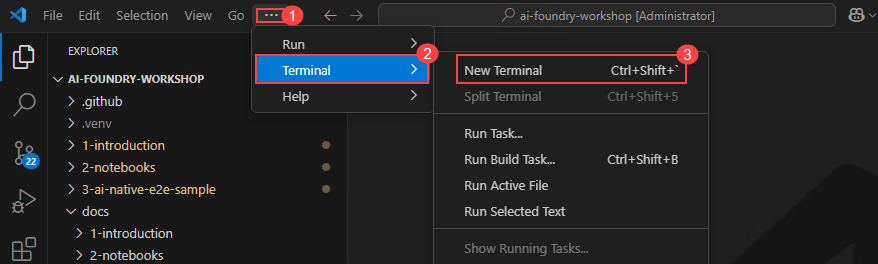

1. Run the following command to activate uv environment.

    ```
     .venv\Scripts\activate
    ```

1. Navigate to the *backend* folder with following command.

   ```
    cd 3-ai-native-e2e-sample\backend
    ```    

1. Run the following command to install the required packages.

   ```
   uv pip install -r requirements.txt
    ```

1. Create new .env file from .env.example file with following command.

    ```
    cp .env.example .env
     ```

1. Open the .env file and add values to `PROJECT_CONNECTION_STRING`, `MODEL_DEPLOYMENT_NAME` and `BING_CONNECTION_NAME` variables. Also, we need to provide configurations details for Event hub as well. Follow the next steps to get the details.

    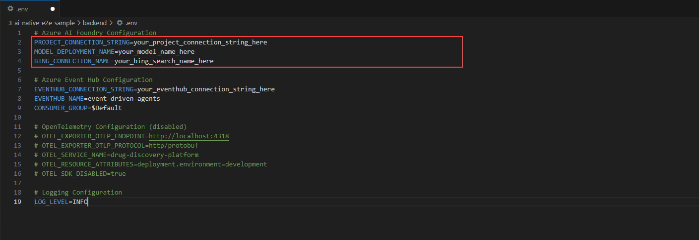

1. In the Azure portal, search for and select **Event Hubs** to create Event hub for this exercise.

    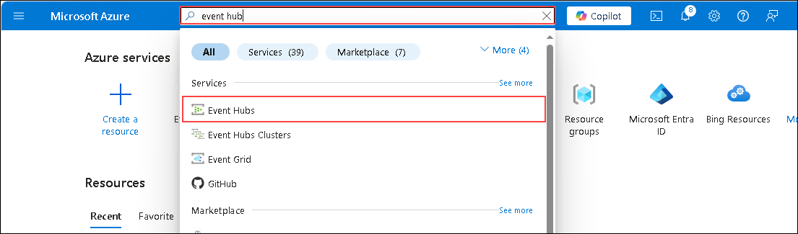

1. Click on **Add** at the top left corner.

    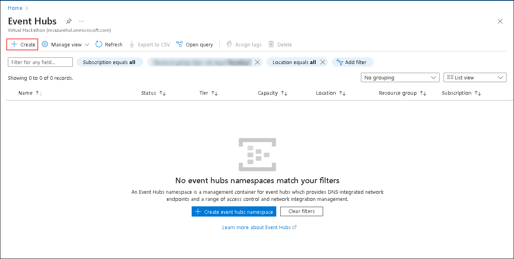

1. In the window that appears, fill in the following details:

   - Subscription- Choose the default Subscription(1)
   - Resource Group- Choose **foundry** (2)
   - Name: **agent-ai-eventhub** (3)
   - Location: **East US** (4)
   - Pricing Tier: **Basic(~11 USD per TU per Month)** (5)
   - Click on **Review + Create** (6) and click on **Create**

        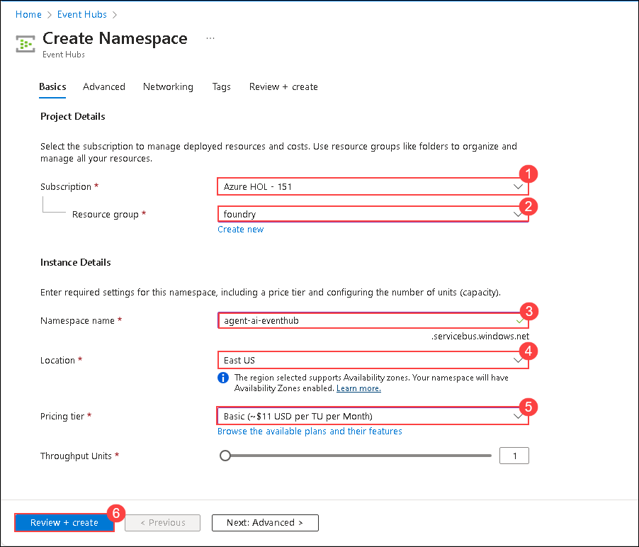

1. Navigate to **agent-ai-eventhub** resource and click on **+ Event Hub**.

    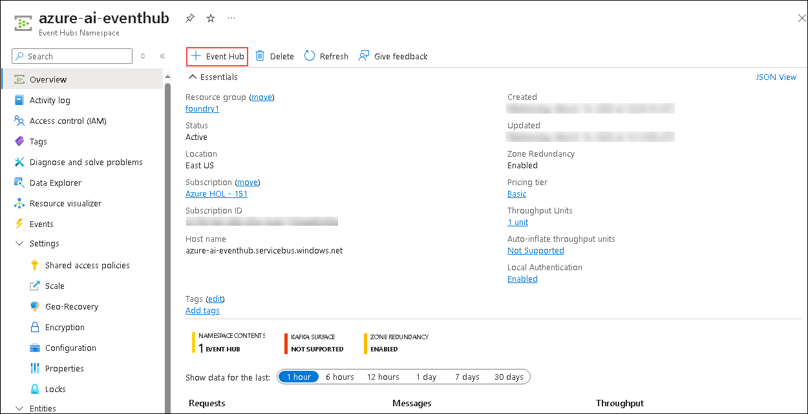

1. In the windows that appears, fill in the following details:

    - Name: **eventhub-instance**(1)
    - Click on **Review + Create** (2) and click on **Create**

        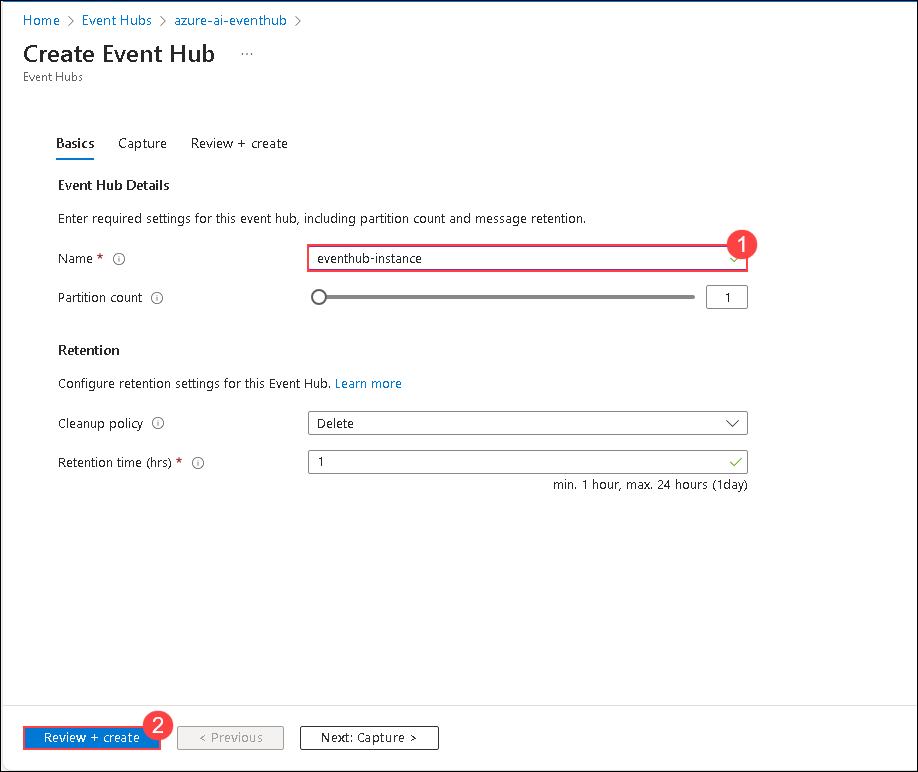

1. Navigate to **agent-ai-eventhub** resource and click on **Event Hubs** under Entities present in left pane.

    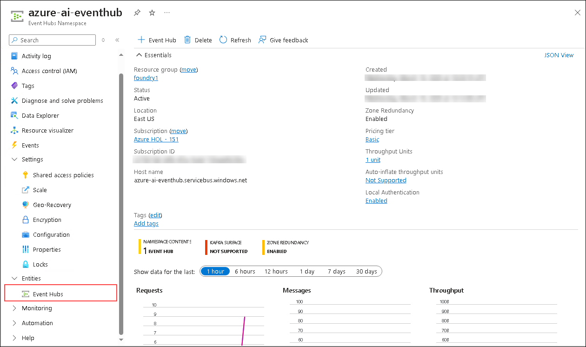

1. Select the **eventhub-instance** in the list.

    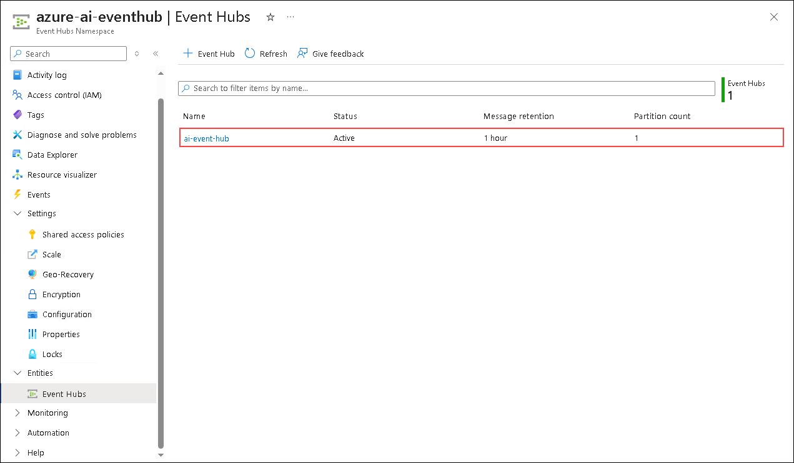

1. Under settings, select **Shared access policies** from left pane.

    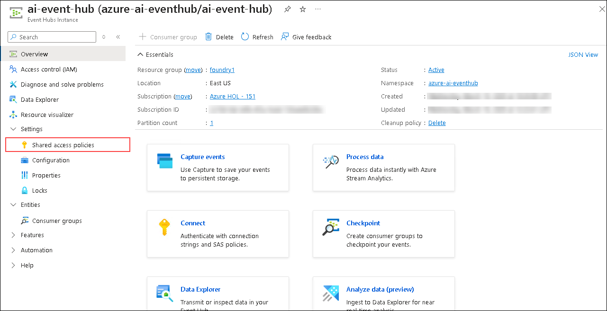

1. Click on **+ Add** (1) which will open **Add SAS Policy** window in the right pane. Proivide the **Policy name** as `backend` (2), select on **Manage** (3) checkbox and click on **Create** (4).

    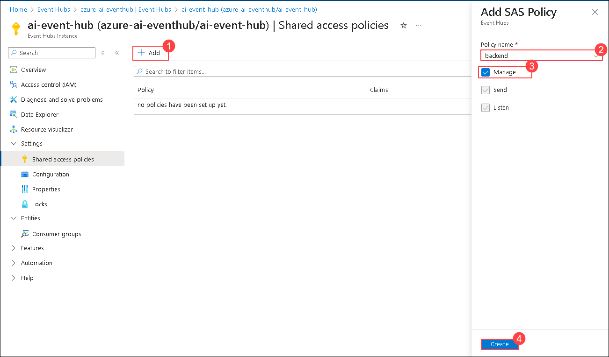

1. After the policy is created, select the policy and copy **Primary connection string**.

    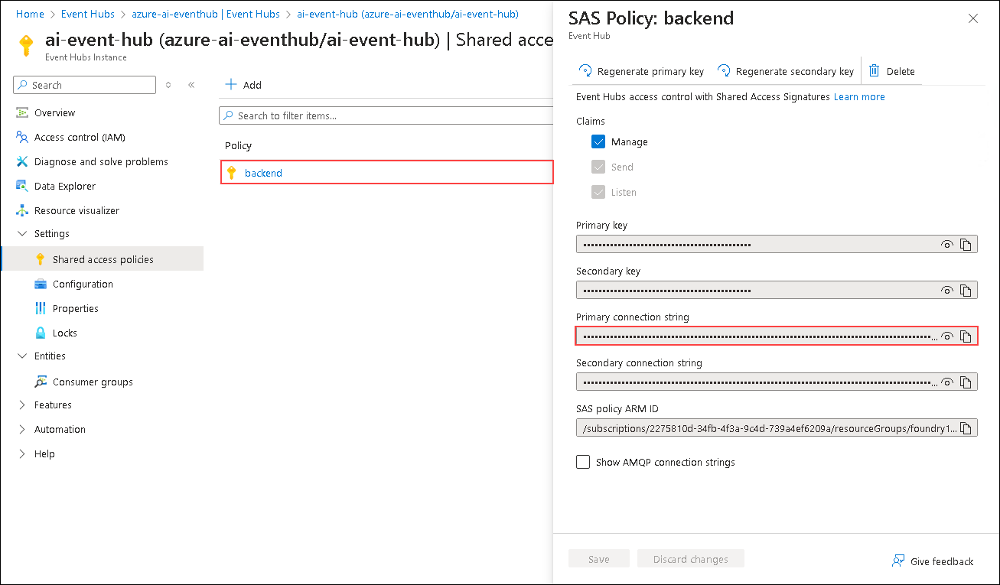

1. Naviagate back to VS code, paste the connection string in `EVENTHUB_CONNECTION_STRING` variable and event hub name in `EVENTHUB_NAME` variable present in .env file.

    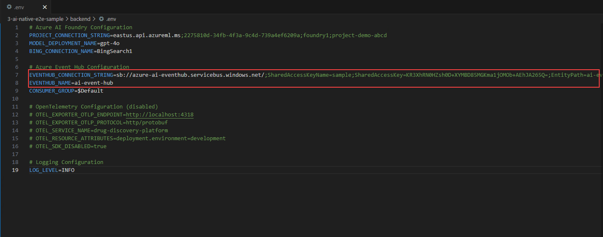
    > Note: Make sure that the connection string is pasted in the format provided in the above image.

1. Run the following command to start the backend server.

   ```
   uvicorn main:app --reload --port 8003
    ```

1. This completes the Backend setup. Now let's move on to Frontend setup. Click on the **elipsis** (1) and choose **Terminal** (2) and click on **New Terminal** (3).

    

1. Run the following command to activate uv environment.

    ```
     .venv\Scripts\activate
    ```

1. Navigate to the *frontend* folder with following command.

   ```
    cd 3-ai-native-e2e-sample\frontend
    ```    

1. Create new .env file from .env.example file with following command.

    ```
    cp .env.example .env
     ```

1. Open the .env file created in frontend subfolder, and provide values to `VITE_AZURE_ENDPOINT`, `VITE_AZURE_MODEL` and `VITE_AZURE_API_VERSION`.

    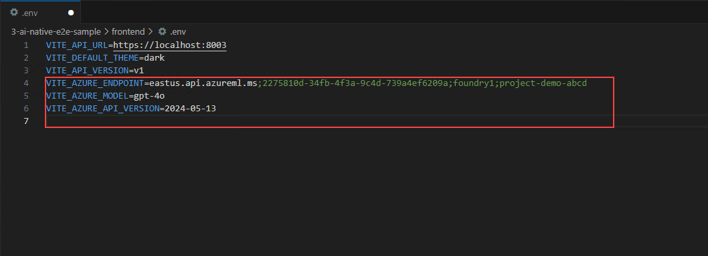

1. Run the following command to install required npm packages:

    ```
    npm install  
    ```

1. Start the application locally:

    ```
    npm run dev
    ```

1. Open the browser and provide the following URL:

    ```
    http://localhost:3000/
    ``` 

    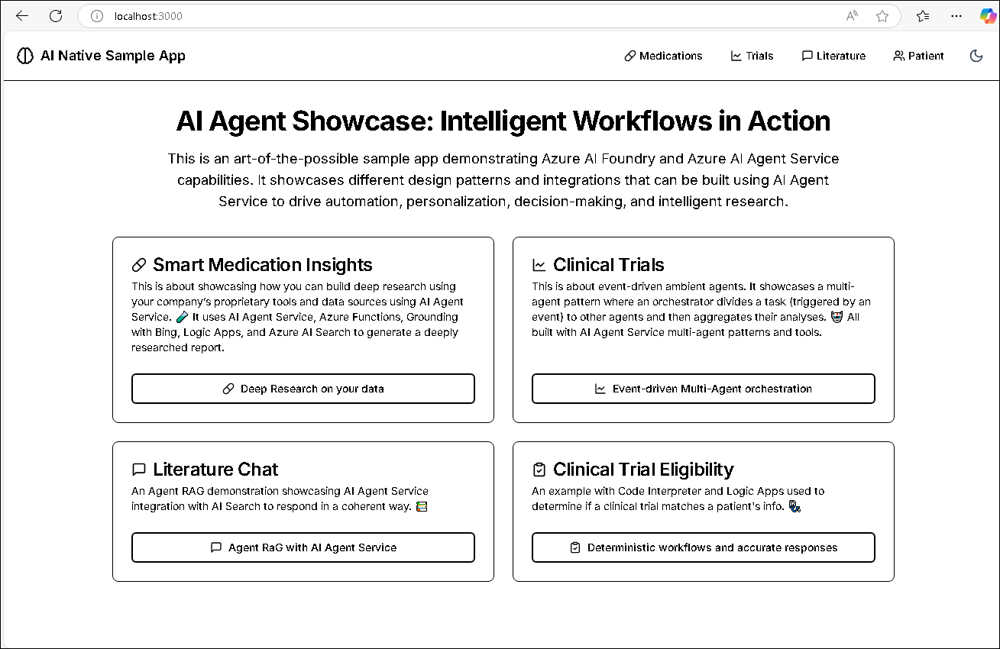
