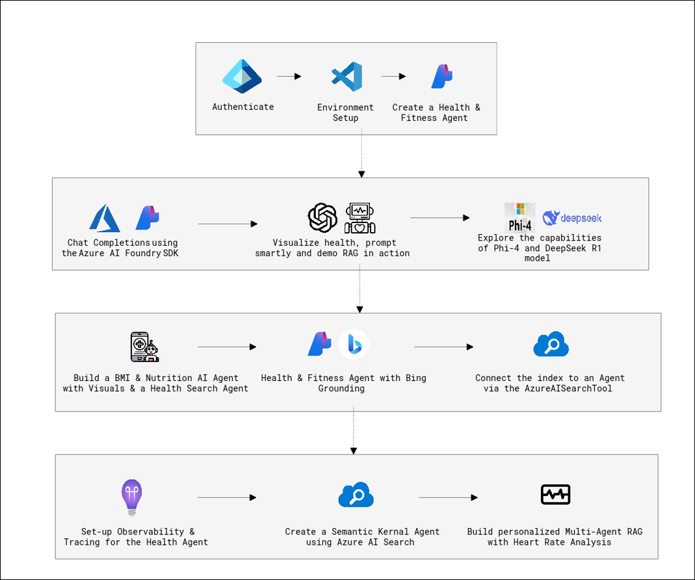
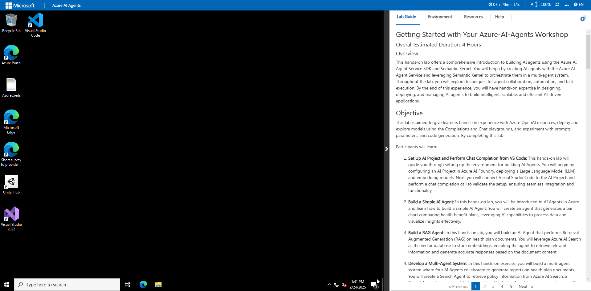
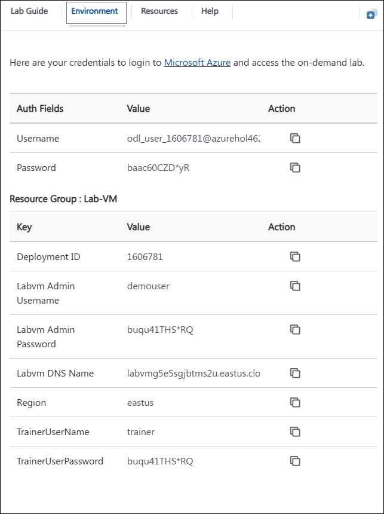
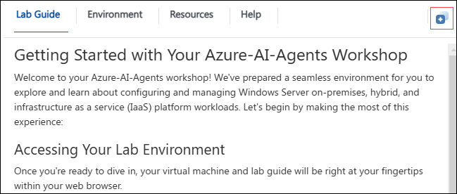

# Getting Started with Your Azure-AI-Agents Workshop
### Overall Estimated Duration: 6 Hours
### Overview

The Azure AI Foundry Workshop is designed to help participants transition from traditional AI models to goal-driven AI solutions. Through hands-on exercises, participants will learn to build intelligent applications that leverage Azure AI Foundry SDK, advanced AI agents, Retrieval-Augmented Generation (RAG), multimodal capabilities, and AI-powered automation.  

The lab begins with setting up the AI development environment, configuring connections, and authenticating credentials. Participants will then explore chat completions, embeddings, and retrieval techniques to enhance AI-driven applications. As they progress, they will develop specialized AI agents for health and fitness, integrating tools for search, reasoning, and real-time data retrieval. Additionally, the workshop covers observability, governance, and AI model evaluation, ensuring AI agents are reliable, safe, and transparent. The final exercises focus on integrating event-driven AI platforms, demonstrating how AI agents can interact with real-world triggers and automate workflows.  

By completing this workshop, participants will gain a strong foundation in building, deploying, and optimizing AI solutions using Azure AI Foundry, empowering them to create dynamic, intelligent, and scalable AI-driven applications.

## Objective 

This lab is designed to provide participants with hands-on experience in developing AI-driven applications using **Azure AI Foundry SDK**. By completing this workshop, participants will learn to:  

- **Set Up and Configure the AI Development Environment**  
  Gain practical experience in initializing an AI project by configuring connections, authentication, and model access within Azure AI Foundry. Participants will authenticate using Azure CLI, validate model connections, and prepare their environment for AI development.  

- **Develop Chat-Based AI Applications with RAG and Multi-Modal Capabilities**  
  Build AI-powered applications using chat completions, retrieval-augmented generation (RAG), and embeddings. Participants will work with advanced AI models like Phi-4 and DeepSeek-R1, applying them to real-world scenarios such as health & fitness coaching and travel planning.  

- **Create and Enhance AI Agents for Intelligent Automation**  
  Learn how to design AI agents that specialize in health and wellness, integrating functionalities such as nutrition guidance, BMI calculations, and health resource search. Participants will enhance AI agents with tools like Bing Grounding and Azure AI Search for multi-agent collaboration.  

- **Integrate AI Agents with Real-World Search and Reasoning Capabilities**  
  Explore how AI agents can interact with external data sources using vector search, hybrid search, and multimodal reasoning. Participants will develop multi-agent RAG pipelines, enabling AI models to provide more relevant and insightful responses.  

- **Implement Observability, Evaluation, and Governance for AI Agents**  
  Ensure AI agent reliability and compliance by integrating observability, tracing, and governance tools. Participants will use OpenTelemetry, Azure Monitor, and automated LLM evaluation to assess AI performance, ensuring responsible AI practices.  

- **Build Event-Driven AI Applications for Real-Time Interactions**  
  Develop AI-native, event-driven architectures that integrate AI agents with Azure Functions. Participants will create automated workflows where AI agents respond to real-time events, showcasing AI's ability to drive intelligent automation.  

### Prerequisites

Participants should have:  

- **Visual Studio Code (VS Code):** Experience in using VS Code for coding, debugging, and managing extensions to work with Python-based AI development.  
- **Programming Knowledge:** Basic understanding of Python, including working with APIs, SDKs, and AI frameworks for model interactions and data processing.  
- **AI & Cloud Concepts:** Familiarity with Azure AI Foundry, AI agent development, LLM-based applications, and Azure AI Search for vector-based retrieval and reasoning.  
- **AI Model & Data Processing Skills:** Understanding of chat completions, embedding models, retrieval-augmented generation (RAG), multimodal reasoning, and prompt engineering.  
- **Multi-Agent AI & Automation Concepts:** Awareness of AI agent architectures, event-driven workflows, AI observability, and governance to manage intelligent AI applications effectively.  

### Architecture

1. **Authentication, Environment Setup & Agent Creation**: The lab begins with authenticating into Azure services, setting up the development environment in Visual Studio Code, and creating a foundational Health & Fitness Agent using the Azure AI Foundry SDK. This setup is crucial to enable interaction with various AI tools and models throughout the lab.

2. **Chat Completions using Azure AI Foundry SDK**: You will learn how to leverage Azure AI Foundry's capabilities to generate chat completions. This forms the basis for intelligent interactions with the Health & Fitness Agent.

3. **Visualizing Health Data & Demonstrating RAG**: Users prompt the system with health-related queries to visualize insights and see Retrieval-Augmented Generation (RAG) in action. This component demonstrates how contextually enriched answers can be generated from health data.

4. **Exploring Foundation Models (Phi-4 & DeepSeek R1)**: The lab introduces advanced open-source models like Phi-4 and DeepSeek R1, showcasing how they can be utilized for health-based generative AI use cases.

5. **Building BMI & Nutrition AI Agent with Visual Output**: You will create a dedicated agent to perform BMI calculations, analyze nutritional data, and present results using visualizations. This demonstrates how agents can perform end-to-end health analytics.

6. **Health & Fitness Agent with Bing Grounding**: An agent is configured to use Bing grounding, enabling it to access and integrate real-time, web-based information to enhance its responses and recommendations.

7. **Connecting Index to Agent with AzureAISearchTool**: The index created from curated health content is connected to the agent using Azure AI Search Tool, enabling precise, context-aware responses through semantic search capabilities.

8. **Setting Up Observability & Tracing**: Observability features are added to monitor the performance and behavior of the Health Agent. Tracing tools help capture logs and metrics for better debugging and transparency.

9. **Creating a Semantic Kernel Agent using Azure AI Search**: You will build a Semantic Kernel Agent, capable of understanding user intent and retrieving accurate information by querying the Azure AI Search index, enhancing the agent's intelligence.

10. **Building Personalized Multi-Agent RAG with Heart Rate Analysis**: The final stage brings together multiple AutoGen agents in a RAG pipeline that performs personalized heart rate analysis. It demonstrates how agents collaborate to process user data and deliver personalized health insights.

### Architecture Diagram

### Explanation of Components

1. **Azure AI Foundry SDK**: Used for building and deploying AI agents with support for chat completions, agent orchestration, and integration with various Azure services.

2. **Visual Studio Code**: The development environment used to run Jupyter notebooks, configure agents, and interact with the Azure ecosystem.

3. **OpenAI (ChatGPT) & Azure OpenAI**: Used for generating responses and enabling intelligent conversation via large language models like GPT-4, Phi-4, and DeepSeek R1.

4. **Phi-4 & DeepSeek R1 Models**:State-of-the-art open-source language models explored for their advanced natural language understanding and generation capabilities.

5. A**zure AI Search & AzureAISearchTool**: Provides powerful vector search capabilities, allowing agents to retrieve semantically relevant data from indexed documents.

6. **Bing Search (via Grounding)**: Used to enrich agent responses with real-time web search results, grounded using Bing’s capabilities for up-to-date health information.

# Getting Started with the Lab
 
Welcome to your Azure AI agents lab, Let's begin by making the most of this experience:

## Accessing Your Lab Environment
 
Once you're ready to dive in, your virtual machine and lab guide will be right at your fingertips within your web browser.
 
  

### Virtual Machine & Lab Guide
 
Your virtual machine is your workhorse throughout the workshop. The lab guide is your roadmap to success.
 
## Exploring Your Lab Resources
 
To get a better understanding of your lab resources and credentials, navigate to the **Environment** tab.
 
  
 
## Utilizing the Split Window Feature
 
For convenience, you can open the lab guide in a separate window by selecting the **Split Window** button from the Top right corner.
 
  
 
## Managing Your Virtual Machine
 
Feel free to start, stop, or restart your virtual machine as needed from the **Resources** tab. Your experience is in your hands!

   

## Lab Guide Zoom In/Zoom Out
 
1. To adjust the zoom level for the environment page, click the **A↕ : 100%** icon located next to the timer in the lab environment.

   

<!-- ## Lab Duration Extension

1. To extend the duration of the lab, kindly click the **Hourglass** icon in the top right corner of the lab environment. 

    

    >**Note:** You will get the **Hourglass** icon when 10 minutes are remaining in the lab.

2. Click **OK** to extend your lab duration.
 
   

3. If you have not extended the duration prior to when the lab is about to end, a pop-up will appear, giving you the option to extend. Click **OK** to proceed. -->

## Let's Get Started with Azure Portal
 
1. On your virtual machine, click on the Azure Portal icon.
2. You'll see the **Sign into Microsoft Azure** tab. Here, enter your credentials:
 
   - **Email/Username:** <inject key="AzureAdUserEmail"></inject>
 
     
 
3. Next, provide your password:
 
   - **Password:** <inject key="AzureAdUserPassword"></inject>
 
      

1. If **Action required** pop-up window appears, click on **Ask later**.
1. If a **Welcome to Microsoft Azure** pop-up window appears, simply click **"Cancel"** to skip the tour.

## Steps to Proceed with MFA Setup if "Ask Later" Option is Not Visible

1. At the **"More information required"** prompt, select **Next**.

1. On the **"Keep your account secure"** page, select **Next** twice.

1. **Note:** If you don’t have the Microsoft Authenticator app installed on your mobile device:

   - Open **Google Play Store** (Android) or **App Store** (iOS).
   - Search for **Microsoft Authenticator** and tap **Install**.
   - Open the **Microsoft Authenticator** app, select **Add account**, then choose **Work or school account**.

1. A **QR code** will be displayed on your computer screen.

1. In the Authenticator app, select **Scan a QR code** and scan the code displayed on your screen.

1. After scanning, click **Next** to proceed.

1. On your phone, enter the number shown on your computer screen in the Authenticator app and select **Next**.
       
1. If prompted to stay signed in, you can click "No."
 
1. If a **Welcome to Microsoft Azure** pop-up window appears, simply click "Maybe Later" to skip the tour.

## Support Contact
 
The CloudLabs support team is available 24/7, 365 days a year, via email and live chat to ensure seamless assistance at any time. We offer dedicated support channels tailored specifically for both learners and instructors, ensuring that all your needs are promptly and efficiently addressed.
 
Learner Support Contacts:
 
- Email Support: [cloudlabs-support@spektrasystems.com](mailto:cloudlabs-support@spektrasystems.com)
- Live Chat Support: https://cloudlabs.ai/labs-support

Click **Next** from the bottom right corner to embark on your Lab journey!
 
   
 
Now you're all set to explore the powerful world of technology. Feel free to reach out if you have any questions along the way. Enjoy your workshop!
